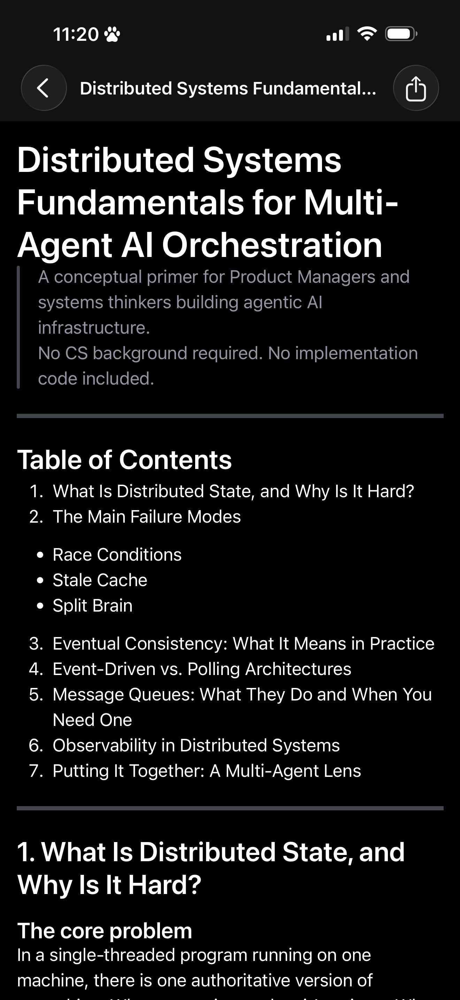
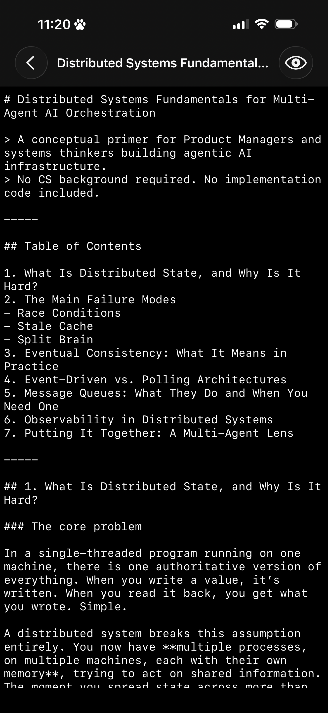
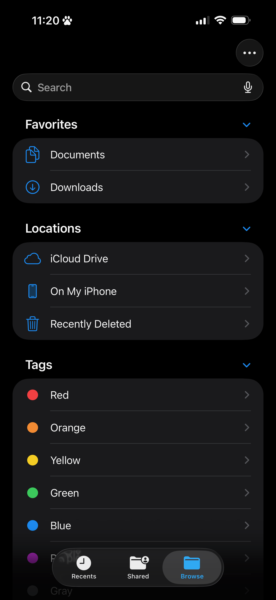

# Markus

A markdown editor for iPhone — and now iPad and Mac — that opens `.md` and `.markdown` files from anywhere in the file system — iCloud Drive, Obsidian, or any other Files-accessible location — and saves changes back to the original file. No vault, no accounts, no onboarding.

Designed for iPhone first, Markus runs as a universal app across iPhone and iPad, and on Mac via Mac Catalyst.

## Screenshots

| Rendered view | Raw editor | Document browser |
| :---: | :---: | :---: |
|  |  |  |

## What it does

- **Rendered view** — GitHub Flavored Markdown displayed with fading navigation chrome. Tap anywhere to switch to the editor.
- **Raw editor** — plain-text editing with native iOS behaviors: list continuation, smart-quote and smart-dash suppression, autocorrect on.
- **Mode toggle** — switch between rendered and raw with scroll-anchor preservation (nearest heading, fractional-scroll fallback).
- **External change detection** — silently absorbs changes from iCloud or other sync services when the file is clean. If you have unsaved edits, a three-option sheet appears: Keep Mine / Keep Theirs / Discard Mine.
- **Last-file resume** — persists the last-opened file via security-scoped bookmark and reopens it directly on next launch.
- **File lifecycle handling** — follows files when they move, shows a deletion banner with Save As when the file is removed, surfaces load errors for non-UTF-8 or oversized files.

## What it doesn't do

No library or vault — your folder structure is the library. No accounts or sync — that's iCloud's job. No settings screen. No onboarding. No proprietary format. Files on disk are always plain `.md` / `.markdown`.

## Platforms

- **iPhone** — iOS 18+ (the primary, originally-designed experience)
- **iPad** — iPadOS 18+ (universal app; responsive layout with a readable max content width)
- **Mac** — via Mac Catalyst

## Requirements

- iOS / iPadOS 18+, or a Mac that runs the Catalyst build
- Xcode 15+
- An Apple Developer account (free tier is sufficient for local runs on a simulator)

## Building and running

1. Open `Markus_v3.xcodeproj` in Xcode. Swift Package Manager resolves dependencies automatically.
2. Pick a destination — an iPhone or iPad simulator/device, or **My Mac (Mac Catalyst)** — then press **Run** (⌘R).

To run tests:

```
xcodebuild test -scheme Markus_v3 -destination 'platform=iOS Simulator,name=iPhone 15'
```

## Project structure

```
Markus_v3/
├── App/              # Entry point and scene lifecycle
├── Host/             # Document browser host controller
├── Documents/        # Document model and save coordination
├── Views/            # Rendered view, raw editor, mode switcher
├── ExternalChange/   # Change detection and conflict resolution
├── Resume/           # Last-file resume via security-scoped bookmarks
├── OpenPath/         # Load pipeline, size ceiling, error mapping
└── Models/           # Scroll anchor, document mode, autosave
```

## License

Copyright © 2026 Evie Hwang.

Markus is free software, licensed under the [GNU General Public License v3.0](LICENSE). You may redistribute and/or modify it under the terms of that license. It is distributed in the hope that it will be useful, but WITHOUT ANY WARRANTY; without even the implied warranty of MERCHANTABILITY or FITNESS FOR A PARTICULAR PURPOSE. See the [LICENSE](LICENSE) file for the full terms.
